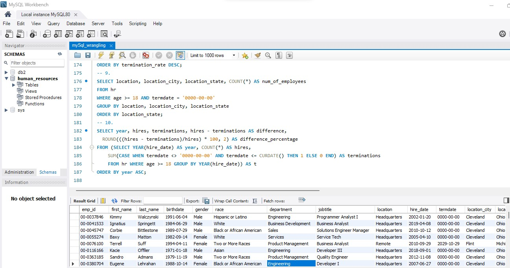
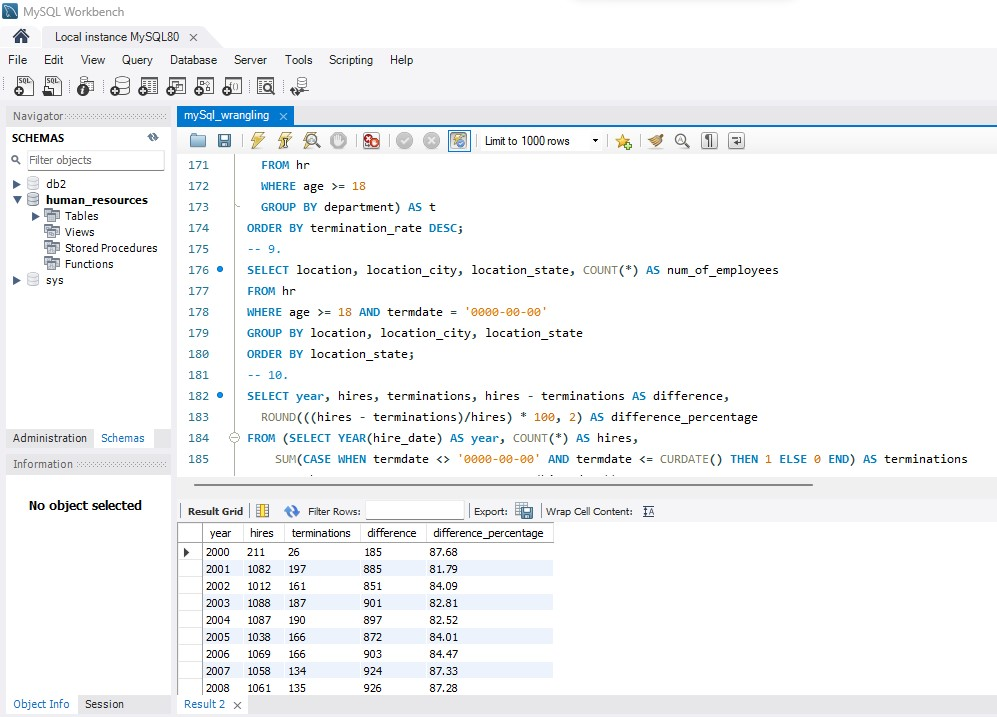
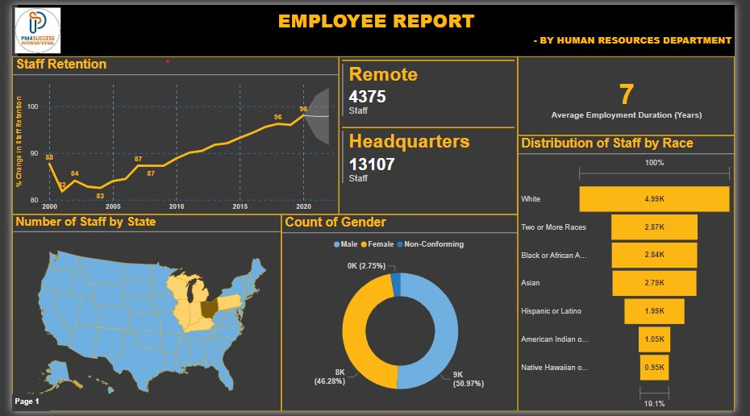
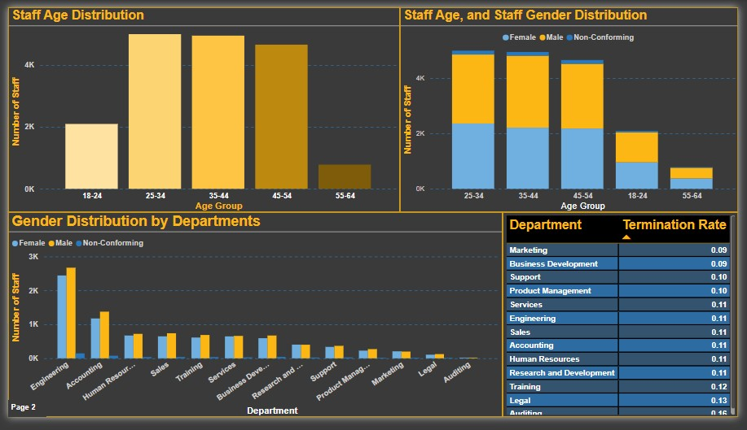

## MySQL x Power BI

Combination of analytical tools maketh a good analyst. Here, MySQL was used for a possible wrangling and subsequent exploration, before using Power BI to create a visual summary of the insights. The combination of MySQL for data wrangling and Power BI for visualization provides a powerful end-to-end solution for data analysis. What are featured here are mainly.
- Data importation into the MySQL and database creation
- Data wrangling and preliminary exploration in the MySQL
- Exportation to Power BI, Table connection, and Visualisation

Data Dictionary:
- Emp_ID : Unique employment identification code issued by the company
- First Name : The first name of a staff
- Last Name  : The last name of a staff
- Birth Date : The birth date of the staff
- Gender : The biological gender of a staff
- Race : The geographical race of a staff
- Department : The functional department/section of a staff within the company
- Job Title : The title of the job role of a staff within the company
- Location : The geographical working branch of a staff within the company 
- Hire Date : Effective date an employee was hired by the company 
- Termination Date: Effective date an employee was dismissed by the company
- Location City : The geographical location of a staff by City
- Location State : The geographical location of a staff by State

The dataset concerns a hypothetical company whose aims was determine their staff retention, location distribution, race distribution and sex distribution, possibly for balancing, optimization, and enhancement of efficiency. Insights from the datasets include:
- The staff retention strength of the company was maximum in 2020, and with the Power BI "Forecast" feature, evident by the grey area of the chart, a prediction of decline by 0.20% is given in the years, 2021 and 2022.
- The headquarters claimed the biggest share of staff working on-site, while remote has the minority.
- The State of Ohio in the United States of America has the highest the majority of the employees, and is no doubt the headquarters of this company, in market and profit.
- Employees basically work with this company for an average of 7 years, which is quite a challenge as regards hiring and training.
- The gender distribution is among the mentioned 3; male, Female, and non-conforming. The Males are just 821 more than the females, with the non-conformers remaining the absolute minority.
- For race, the balance is quite poor since the Whites are absolute majority by the thousands, and the native Hawaiians being the clear minority.
- The optimal age group working within the company is 25 - 34 years of age, with 55-64 being the minimum. The latter could be due to retirement, rare hiring of staff within that age bracket.
- The male gender, and the 25-34 age group are the most employed across all boards. people with non-conforming gender remain the minority.
- The Engineering department seems to be the powerhouse of this company. which could obviously be technological based, bearing the lion's share of the total number of employees. The gender and age distribution remain as discussed above.
- As it concerns staff leaving the company, the Marketing and Business Development Departments have the lowest rate of employees leaving the company, with the Auditing department claiming the highest rate.

MySQL is a powerful relational database management system that can be used for data cleaning and preparation tasks. With MySQL, you can import raw data into a database, allowing one to perform various cleaning operations on it. The data cleaning tasks in MySQL may include removing duplicates, handling missing values, standardizing data formats, and correcting inconsistent entries.

MySQL provides functions and tools to handle missing values, such as replacing them with appropriate values or removing rows with missing data. With these functions, one can run basic calculations like average, sum, subtraction, in bid to replace missing values. By leveraging MySQL's string manipulation functions, you can standardize data formats, convert text to uppercase or lowercase, and remove unnecessary characters. Then comes "Derived Table", which is a table gotten from calculations involving two or more existing columns, giving rise to a new kind of table featuring the results from such calculations. One common error in creating a derived table is omitting closing brackets and aliasing it using the AS function.

Once the data wrangling and possible preliminary exploration must have been done in MySQL, one can export it to a format suitable for visualization tools like Power BI. Power BI is a business intelligence tool that enables you to create interactive visualizations and reports from your MySQL data, and so on. Also, one can use the Power BI's intuitive drag-and-drop interface to connect the MySQL database and import the wrangled and explored data.

Power BI offers a wide range of visualization options, including charts, graphs, maps, and tables, allowing you to represent your data in a meaningful way. Power BI's data modelling capabilities allows creation of relationships between different tables in the MySQL database, enhancing data analysis capabilities. Power BI also allows for the application of various data transformation operations on the MySQL data, such as filtering, sorting, and aggregating, to further refine your visualizations. The Interactive features in Power BI enable users to drill down into the data, filter information, and perform ad-hoc analysis, making it easier to gain insights from your MySQL dataset. The Power BI offers collaboration and sharing features, for easy, and most of all, secured collaboration with colleagues.
If observed, one will notice the terminal of the trendline in the line chart of "Staff Retention" is different, and shaded grey. That part is the forecasted points/values, as Power BI runs a <b>"Forecast"</b> feature that predicts a likely outcome based on previous values. And like linear regression, this too has its own limitations.

